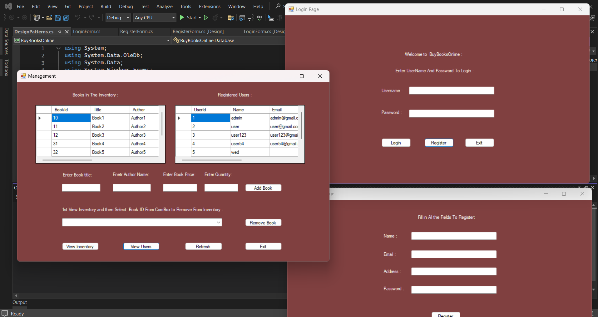

# 📚 BuBooksOnline

**BuBooksOnline** is a desktop application developed for efficient **library management**, designed with **C# .NET (Windows Forms)** and **MS Access** as the database backend.  
This project enables users to manage book inventory, track borrowing/returning, and maintain member records through an easy-to-use interface.

🚀 **Key Features**  
- Add, update, delete, and search for books and members.  
- Track book lending and returns with transaction history.  
- Simple and intuitive **Windows Forms** GUI.  
- Integrated **MS Access Database** for smooth local storage.  
- Validation checks to prevent invalid data entries.  
- Lightweight, fast, and offline-accessible system.

🛠 **Built With**  
- **Language**: C# (.NET Framework)  
- **Framework**: Windows Forms  
- **Database**: MS Access (.accdb)  
- **Development Environment**: Visual Studio

🎯 **Objective**  
To create a reliable and user-friendly **Book Management System** for libraries, small institutions, or personal use, ensuring smooth inventory and transaction management.

📷 **Screenshots**  

